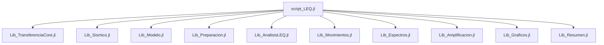

# Análisis Sísmico con Método Lineal Equivalente (LEQ)

[](https://julialang.org/)
[](https://opensource.org/licenses/MIT)

> Programa completo en Julia para análisis sísmico de suelos utilizando el método lineal equivalente con arquitectura modular optimizada.

## 🎯 Características Principales

- ✅ **Análisis completo de respuesta sísmica** en perfiles estratificados
- ✅ **Método lineal equivalente** con convergencia iterativa
- ✅ **Deconvolución sísmica** automática a roca basal
- ✅ **Espectros de respuesta** y funciones de amplificación
- ✅ **Comportamiento no lineal** de suelos y lineal de rocas
- ✅ **9 módulos especializados** para máxima eficiencia
- ✅ **Detección automática** de formatos de archivo
- ✅ **Gráficos profesionales** integrados

## 🚀 Inicio Rápido

### 1. Clonar el Repositorio
```bash
git clone https://github.com/tu_usuario/analisis-sismico-leq.git
cd analisis-sismico-leq
```

### 2. Instalar Dependencias
```julia
julia
] activate .
instantiate
```

### 3. Ejecutar Ejemplo
```julia
julia script_LEQ.jl
```

## 📊 Resultados de Ejemplo

El programa genera automáticamente:


- 📈 **Gráficos completos** del análisis sísmico
- 📄 **Señal deconvolucionada** en formato de texto
- 📋 **Resumen técnico** en consola

## 🏗️ Arquitectura



## 🛠️ Tecnologías

- **Julia** 1.6+ - Lenguaje de programación científica
- **FFTW.jl** - Transformadas de Fourier optimizadas
- **Plots.jl** - Visualización de datos avanzada
- **LinearAlgebra** - Operaciones matriciales eficientes

## 📚 Documentación

- [**Guía de Usuario**](docs/GUIA_USUARIO.md) - Tutorial completo
- [**API Reference**](docs/API.md) - Documentación de funciones
- [**Ejemplos**](examples/) - Casos de uso prácticos
- [**Metodología**](docs/METODOLOGIA.md) - Fundamentos teóricos

## 🤝 Contribuir

¡Las contribuciones son bienvenidas! Ver [CONTRIBUTING.md](CONTRIBUTING.md) para detalles.

1. Fork el proyecto
2. Crea tu rama de feature (`git checkout -b feature/AmazingFeature`)
3. Commit tus cambios (`git commit -m 'Add some AmazingFeature'`)
4. Push a la rama (`git push origin feature/AmazingFeature`)
5. Abre un Pull Request

## 📄 Licencia

Distribuido bajo la Licencia MIT. Ver `LICENSE` para más información.

## 👨‍💻 Autor

**[Tu Nombre]** - [@tu_usuario](https://github.com/tu_usuario)

Enlace del Proyecto: [https://github.com/tu_usuario/analisis-sismico-leq](https://github.com/tu_usuario/analisis-sismico-leq)

## 🙏 Reconocimientos

- [Julia Community](https://julialang.org/community/) por el excelente ecosistema
- Referencias técnicas en geotecnia sísmica
- Colaboradores y usuarios del proyecto